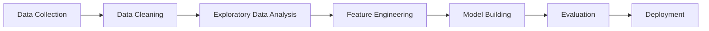

# 🚀 Data Science Placement Repository

<div align="center">


<br/>


<br/><br/>


</div>

---

# 📌 About This Repository

This repository is a complete collection of **Data Science placement preparation resources**, including:

* 📊 Data Analysis
* 🤖 Machine Learning
* 🐍 Python Programming
* 🗄️ SQL Practice
* 📈 Data Visualization
* 🧠 Interview Preparation
* 📚 Jupyter Notebooks
* 🛠️ Real-world Projects

It is designed to help students and aspiring developers prepare for:

* Data Science Placements
* Machine Learning Interviews
* Analytics Roles
* Python Developer Positions
* AI & ML Internships

---

# 🧠 Topics Covered

<div align="center">

| Category            | Topics                                  |
| ------------------- | --------------------------------------- |
| 🐍 Python           | Basics, OOPs, Functions, Libraries      |
| 📊 Data Analysis    | Pandas, NumPy, Data Cleaning            |
| 📈 Visualization    | Matplotlib, Seaborn, Plotly             |
| 🤖 Machine Learning | Regression, Classification, Clustering  |
| 🗄️ SQL             | Queries, Joins, Aggregations            |
| 📉 EDA              | Data Cleaning, Missing Values, Insights |
| 🧠 Interview Prep   | Coding Questions & Concepts             |
| 🚀 Projects         | Real-world ML & DS Projects             |

</div>

---

# ⚙️ Tech Stack

<div align="center">


<br/><br/>


</div>

---

# 📂 Repository Structure

```bash
Data_science_placement/
│
├── Python/
├── SQL/
├── Machine_Learning/
├── EDA/
├── Visualization/
├── Projects/
├── Datasets/
├── Interview_Questions/
└── README.md
```

---

# 📊 Data Science Workflow



---

# 🚀 Featured Learning Areas

## 📌 Python for Data Science

* Variables & Data Types
* Functions & Modules
* OOP Concepts
* Exception Handling
* File Handling
* Libraries for DS

---

## 📊 Exploratory Data Analysis

* Data Cleaning
* Missing Values Handling
* Outlier Detection
* Correlation Analysis
* Statistical Insights
* Visualization Techniques

---

## 🤖 Machine Learning Concepts

### Supervised Learning

* Linear Regression
* Logistic Regression
* Decision Trees
* Random Forest
* Support Vector Machines

### Unsupervised Learning

* K-Means Clustering
* PCA
* Hierarchical Clustering

---

# 📈 Visualization Examples

<div align="center">

| Visualization   | Purpose                 |
| --------------- | ----------------------- |
| 📉 Line Plot    | Trends Over Time        |
| 📊 Bar Chart    | Category Comparison     |
| 🥧 Pie Chart    | Percentage Distribution |
| 🔥 Heatmap      | Correlation Matrix      |
| 📦 Box Plot     | Outlier Detection       |
| ☁️ Scatter Plot | Relationship Analysis   |

</div>

---

# 🧩 Placement Preparation

## Topics Frequently Asked in Interviews

* Python Fundamentals
* OOPs Concepts
* NumPy & Pandas
* SQL Queries
* Statistics & Probability
* Machine Learning Algorithms
* Data Cleaning Techniques
* Model Evaluation Metrics
* Case Studies
* Problem Solving

---

# 💡 Future Improvements

* ✅ More ML Projects
* ✅ Deep Learning Section
* ✅ NLP Projects
* ✅ Power BI Dashboards
* ✅ Tableau Visualizations
* ✅ End-to-End Deployment Projects

---

# 📌 How to Use This Repository

## Clone the Repository

```bash
git clone https://github.com/AmanSri3130/Data_science_placement.git
```

## Navigate into the Folder

```bash
cd Data_science_placement
```

## Install Required Libraries

```bash
pip install -r requirements.txt
```

---

# 🌟 Contribution Guidelines

Contributions are welcome!

If you want to contribute:

1. Fork the repository
2. Create a new branch
3. Add your improvements
4. Commit changes
5. Create a Pull Request

---

# 📬 Connect With Me

<div align="center">

<a href="https://github.com/AmanSri3130">

</a>

<a href="https://linkedin.com">

</a>

<a href="https://instagram.com">

</a>

</div>

---

# ⭐ Support

If you found this repository useful:

🌟 Star the repository
🍴 Fork the repository
📢 Share with others

---

<div align="center">

## ⚡ Keep Learning • Keep Building • Keep Growing ⚡

<br/>


</div>
